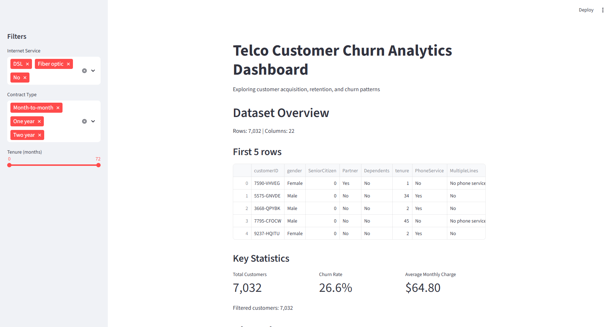
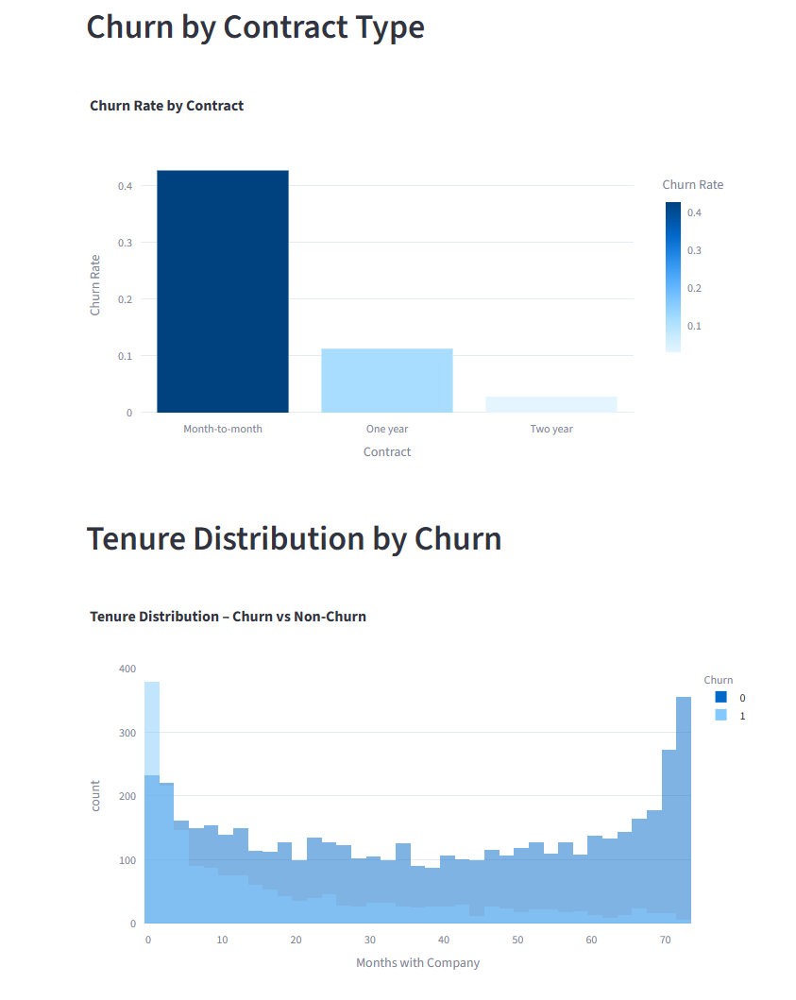
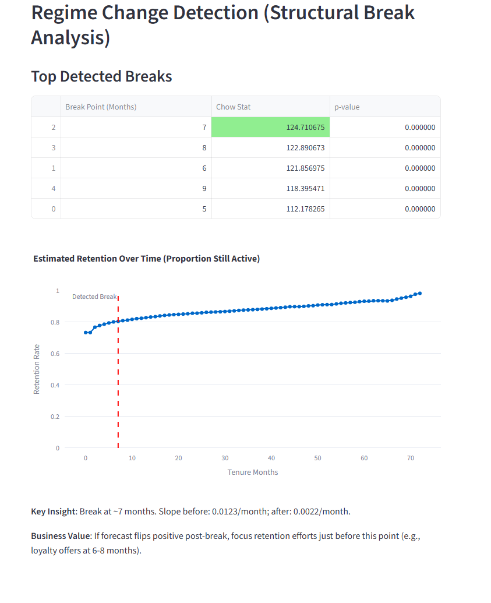
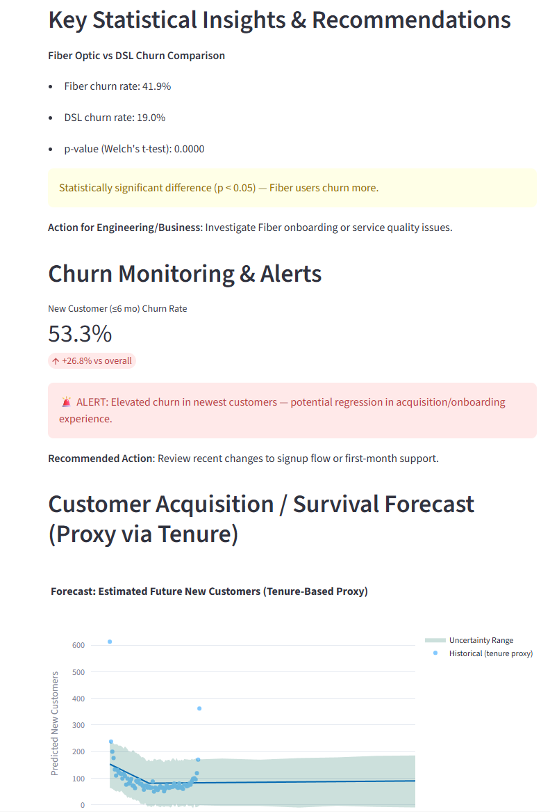

# Telco Customer Churn & Retention Analytics Dashboard

Interactive Streamlit app analyzing customer churn patterns, retention cohorts, statistical regime changes, and acquisition forecasting (tenure proxy).

GitHub: [scmorris2003/telco-customer-churn-dashboard](https://github.com/scmorris2003/telco-customer-churn-dashboard)

## Features
- KPI metrics (churn rate, avg tenure, etc.)
- Interactive filters (contract, internet service, tenure range)
- Visuals: churn by segment, tenure distribution, retention curves
- Statistical insights: t-tests, regime change detection (Chow test)
- Monitoring alerts for elevated churn in new customers
- Forecasting: Prophet-based future customer trends

## Screenshots

### Overview & KPIs

### Churn Types

### Retention Curve with Regime Break

### Insights & Forecasting Section

(Add more — see below on how to take them)

## How to Run Locally
1. Clone repo
2. `pip install -r requirements.txt`
3. `streamlit run app.py`

## Tech Stack
- Streamlit (frontend/dashboard)
- Pandas, NumPy, Plotly
- Prophet (forecasting)
- Statsmodels + SciPy (statistical tests)

## Business Value
Demonstrates ability to build high-visibility dashboards for customer growth/experience trends, detect regressions via structural breaks, generate statistically-backed action items, and forecast acquisition — aligned with analytics & monitoring roles.
